In distributed systems, ensuring that a user sees their own updates immediately is a classic challenge known as the **Read-after-Write** (or **Read-your-Writes**) consistency problem. This post explores why it happens and how to solve it effectively.

## The Problem: Replication Lag

In a typical **Leader-Follower replication** architecture, write operations go to the Leader database, while read operations are distributed across multiple Followers to balance the load.

1. **User Action:** A user makes a payment (Write to Leader).
2. **Replication:** The Leader sends the update to Followers. This takes time (100–500ms lag).
3. **Immediate Read:** The user’s dashboard immediately queries a Follower to show the new balance.
4. **Stale Data:** If the Follower hasn't received the replication yet, it returns the old balance.

### Why This Matters

- **Duplicate Actions:** Confused users might click "Pay" again, causing duplicate charges.
- **Trust Erosion:** The app feels broken or unreliable when it doesn't reflect user actions instantly.
- **Customer Support:** Increased tickets from users reporting balance issues that are actually just replication lag.

---

## The Solutions

Here are three common strategies to implement **Read-your-Writes** consistency.

### 1. Client-Side Caching (Instant UI)

The simplest approach: don't even wait for the database sync for the immediate next UI state.

```mermaid
graph LR
    User[👤 User] -- "1. Make Payment" --> App[App]
    App -- "2. Write" --> Leader[(Leader DB)]
    
    Leader -- "3. New Balance" --> App
    
    App -- "4. Use Response Balance<br/>(INSTANT UI)" --> User
    
    Leader -. "5. Sync Later" .-> Follower[(Follower DB)]

    style Leader fill:#e6f7ff,stroke:#91d5ff
    style Follower fill:#fafafa,stroke:#d9d9d9,stroke-dasharray: 5 5
    style User fill:#f6ffed,stroke:#b7eb8f
```

- **Approach:** Use the data returned directly from the successful write API call to update the UI.
- **Pros:** Feels instant; reduces server load.
- **Cons:** Complex cache invalidation; temporary inconsistency if the user refreshes or switches devices.

### 2. Session-Based / Sticky Routing

Route the user to the Leader for a short "window" after any write operation.

```mermaid
graph LR
    User[👤 User] -- "1. Make Payment" --> App[App]
    App -- "2. Write" --> Leader[(Leader DB)]
    Leader -. "5. Sync Later" .-> Follower[(Follower DB)]

    User -- "3. Read Request" --> App
    
    App -- "4a. If < 5s since Write:<br/>Route to Leader" --> Leader
    App -- "4b. If > 5s since Write:<br/>Route to Follower" --> Follower

    style Leader fill:#e6f7ff,stroke:#91d5ff
    style Follower fill:#fafafa,stroke:#d9d9d9,stroke-dasharray: 5 5
    style User fill:#f6ffed,stroke:#b7eb8f
```

- **Approach:** Track the timestamp of the user's last write. If a read occurs within a few seconds (e.g., 5s), force the read to the Leader.
- **Pros:** Stronger consistency across page loads in a session.
- **Cons:** Can overload the Leader if many users are writing; session management complexity.

### 3. Version-Based Consistency

Ensure the Follower is caught up before serving the read.

```mermaid
graph LR
    User[👤 User] -- "1. Make Payment" --> App[App]
    
    App -- "2. Write" --> Leader[(Leader DB<br/>Sets Version: 101)]
    
    Leader -- "3. Success + **Version 101**" --> App
    
    User -- "4. Read Request" --> App
    
    App -- "5. Ask Follower:<br/>'Do you have Version 101?'" --> Follower[(Follower DB)]
    
    Follower -- "6a. YES (Has v101):<br/>Return Balance" --> App
    Follower -. "6b. NO (Still on v100):<br/>Wait for Sync or Route to Leader DB" .-> Follower
    
    Leader -. "7. Sync Later (Sends v101)" .-> Follower

    style Leader fill:#e6f7ff,stroke:#91d5ff
    style Follower fill:#fafafa,stroke:#d9d9d9,stroke-dasharray: 5 5
    style User fill:#f6ffed,stroke:#b7eb8f
```

- **Approach:** Tag writes with a version number (LSN/GTID). On read, the app asks the Follower for that specific version.
- **Pros:** Strict global consistency; handles switching devices.
- **Cons:** Technically difficult to implement; potential minor latency if a Follower is lagging significantly.

---

## Comparison Summary

| Feature | Client-Side Caching | Session-Based Routing | Version-Based Consistency |
| :--- | :--- | :--- | :--- |
| **Complexity** | Low | Medium | High |
| **Consistency** | Local (UI-only) | Probabilistic | Strict (Global) |
| **Data Integrity** | Lost on refresh | Sensitive to lag | Guaranteed |
| **Infrastructure** | Standard API | Cache (e.g., Redis) | DB support (GTIDs/LSNs) |

## Conclusion

Most production systems use a hybrid approach. For example, **Client-Side Caching** for immediate visual feedback, combined with **Session-Based Routing** for the subsequent few seconds to ensure a smooth transition across pages.

By implementing these strategies, you can build systems that remain fast and scalable without sacrificing the user experience.

---

*This post is based on concepts from **Chapter 5: Replication** in "Designing Data-Intensive Applications" by Martin Kleppmann.*
