## Purpose
To demonstrate solving the Read-after-Write consistency problem in distributed database systems, ensuring users always see their own updates immediately.

## The Legacy Follower Read

In the `legacy-follower-read`, the system uses a **Leader-Follower replication** architecture where writes go to the Leader but reads are routed to Followers to distribute load.

- **Pattern:** "Random follower routing" for read queries.
- **Logic:** User makes a payment (writes to Leader), then the dashboard queries a Follower to display the balance.
- **Problem:** Replication lag (100-500ms) means the Follower might not have the latest data yet.

## Issues

- **Stale Data:** The user sees their old balance ($1000) instead of the updated balance ($900) because the read hits a Follower that hasn't received the replication yet.

- **Duplicate Payments:** Seeing the unchanged balance, the user thinks the payment failed and clicks "Pay" again, potentially causing duplicate charges.

- **Trust Erosion:** Users lose confidence in the system when it doesn't immediately reflect their actions. This makes the app feel broken or unreliable.

- **Support Tickets:** Increased customer service load as confused users contact support saying "my payment didn't work" when it actually did.

## The Read-Your-Writes Solution

In the `read-your-writes`, we can implement one or more of these strategies to solve the problem and ensure users always see their own writes immediately, even with replication lag.

### 1. Client-Side Caching

```mermaid
graph LR
    User[👤 User] -- "1. Make Payment" --> App[App]
    App -- "2. Write" --> Leader[(Leader DB)]
    
    Leader -- "3. New Balance" --> App
    
    App -- "4. Use Response Balance<br/>(INSTANT UI)" --> User

    Leader -. "5. Sync Later" .-> Follower[(Follower DB)]

    style Leader fill:#e6f7ff,stroke:#91d5ff
    style Follower fill:#fafafa,stroke:#d9d9d9,stroke-dasharray: 5 5
    style User fill:#f6ffed,stroke:#b7eb8f
```

- **Approach:** When the payment succeeds, return the updated balance in the API response. Cache it on the client side and display it immediately without making another database query.
- **Pros:**
    - Snappy Performance: The app feels instant because the UI updates the moment the user clicks a button.
    - Less Database Stress: Saves server resources by skipping unnecessary read requests.
    - Low implementation effort: Easy to implement using basic UI state management.

- **Cons:**
    - Cache Invalidation Complexity: Ensuring the cache is updated or cleared correctly when data changes elsewhere is tricky.
    - Inconsistency: Users may see outdated info, especially when switching devices or if the cache isn’t refreshed promptly.

### 2. Session-Based Routing

```mermaid
graph LR
    User[👤 User] -- "1. Make Payment" --> App[App]
    App -- "2. Write" --> Leader[(Leader DB)]
    Leader -. "5. Sync Later" .-> Follower[(Follower DB)]

    User -- "3. Read Request" --> App
    
    App -- "4a. If < 5s since Write:<br/>Route to Leader" --> Leader
    App -- "4b. If > 5s since Write:<br/>Route to Follower" --> Follower

    style Leader fill:#e6f7ff,stroke:#91d5ff
    style Follower fill:#fafafa,stroke:#d9d9d9,stroke-dasharray: 5 5
    style User fill:#f6ffed,stroke:#b7eb8f
```

- **Approach:** Track the last write timestamp for each user session. If a read request comes within X seconds (e.g., 5s) of a write, route it to the Leader instead of a Follower.
- **Pros:**
    - Stronger consistency: across page loads in a session; not limited to just the immediate client cache.
    - Efficient load balancing: Directs only necessary traffic to the Leader, preserving Follower capacity for general reads
    - Low implementation effort: Easy to integrate with existing session management or centralized stores like Redis.
- **Cons:**
    - Only works for the same device/session; fails if user switches devices.
    - Can overload the Leader with read traffic and is complex to manage across distributed services.

### 3. Version-Based Consistency

```mermaid
graph LR
    User[👤 User] -- "1. Make Payment" --> App[App]
    
    App -- "2. Write" --> Leader[(Leader DB<br/>Sets Version: 101)]
    
    Leader -- "3. Success + **Version 101**" --> App

    User -- "4. Read Request" --> App

    App -- "5. Ask Follower:<br/>'Do you have Version 101?'" --> Follower[(Follower DB)]

    Follower -- "6a. YES (Has v101):<br/>Return Balance" --> App
    Follower -. "6b. NO (Still on v100):<br/>Wait for Sync or Route to Leader DB" .-> Follower

    Leader -. "7. Sync Later (Sends v101)" .-> Follower

    style Leader fill:#e6f7ff,stroke:#91d5ff
    style Follower fill:#fafafa,stroke:#d9d9d9,stroke-dasharray: 5 5
    style User fill:#f6ffed,stroke:#b7eb8f
```

- **Approach:** Tag each write with a monotonically increasing version number or timestamp. On read, check if the Follower has caught up to that version. If not, either wait briefly or route to Leader.
- **Pros:**
    - Guarantees up-to-date data everywhere: ensures users always see their latest changes on any device, browser, or session.
    - Highly scalable: Minimizes load on the Leader; only waits or reroutes if a Follower is actually behind.
- **Cons:**
    - Technically difficult: Requires significant changes to code and database to track and pass version numbers.
    - Potential for minor delays: Users may experience a brief pause if a Follower is slow to sync.

## How it solves the problems

- **Stops Double-Paying:** Users see their new balance instantly, so they don’t accidentally click "Pay" twice out of confusion.

- **Feels More Reliable:** A snappy, consistent experience builds user trust and cuts down on "is this broken?" support calls.

- **Keeps the App Fast:** The system stays quick for everyone because it only uses the main database when it absolutely has to.

## When to use one or more of these solutions

Most real-world payment systems use these strategies together to ensure users always see their updated balance immediately after making a payment.

- **Client-Side Caching:** On the payment confirmation page, show the new balance immediately using the value returned in the payment API response. No waiting, no stale data, no extra network trip.

- **Session-Based Routing:** If the user navigates to another page (like from the payment screen to their dashboard) within a short window (e.g., 5–10 seconds), keep routing reads to the Leader for a few seconds after a payment to prevent "flicker" or confusion, even if the Follower might still be catching up.

- **Version-Based Consistency:** For background checks, after the stickiness window expires, or for important payment operations, make sure the Follower DB is fully up-to-date before showing the user's balance, using version numbers as a final safety net.

By using one or more of these solutions, you ensure users always see their updated balance immediately after making a payment, while the system stays fast, reliable, and scalable.

| Feature | Solution 1: Client-Side Caching | Solution 2: Session-Based | Solution 3: Version-Based |
| :--- | :--- | :--- | :--- |
| **Complexity** | Low | Medium | High |
| **Consistency** | Local (UI-only) | Probabilistic | Strict (Global) |
| **Implementation** | UI uses direct API response | Caches "Last Write" time | App verifies DB sequence sync |
| **Data Integrity** | Lost on page refresh | Sensitive to lag | Guaranteed; never stale |
| **Infrastructure** | Standard API/Frontend | Cache (Redis/Memcached) | DB support (GTIDs/LSNs) |

## Reference

This implementation is based on concepts from **Chapter 5: Replication** in the book **Designing Data-Intensive Applications**, specifically the section on "Read-after-write consistency" (also known as "read-your-writes consistency").
